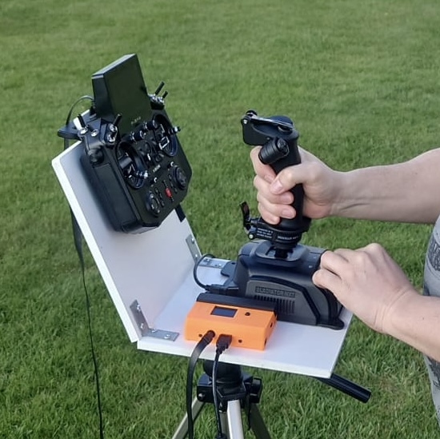
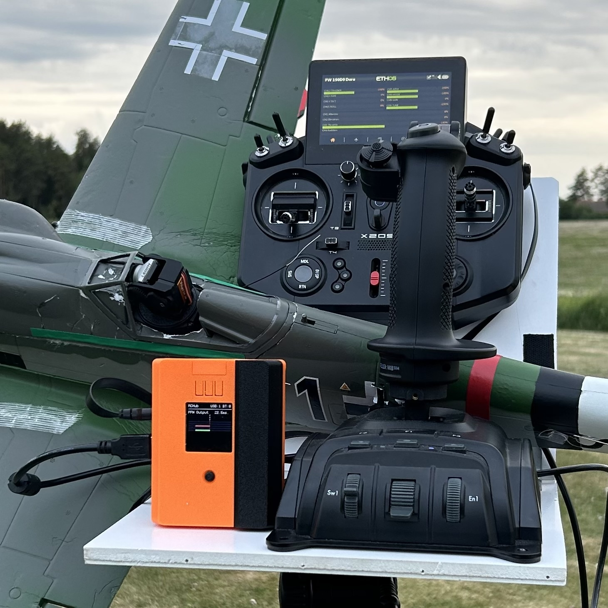

# RCHub: USB-to-PPM converter with Bluetooth

RCHub lets you control
- a plane with a stick or H.O.T.A.S.;
- a car with a USB steering wheel and pedals;
- a mini-quad with a game console controller;
- and any combination of above, plus connect a [wireless bluetooth head tracker](https://github.com/ysoldak/HeadTracker)!

<table>
<tr><td>

</td><td>

</td></tr>
</table>

## Features

- **Auto-discovery joystick devices**
  - Recognizes and pre-configures any new USB controller;
  - **Up to 8 joysticks** simultaneously.  
    _you'll need a separate USB hub for that, as RCHub has only one physical USB port._

- **Built-in display** with 5-way joystick and 3 buttons for easy configuration
  - **Up to 16 output channels** configurable directly on screen, no config file editing needed
  - **Color-coded** channel visualisations, by source
    - red - axis,
    - green - button,
    - blue - bluetooth.
  - **Raw data view** page  
    _see the raw data your joystick sends, access state of it, deadzones, axis and button numbers_

- **Bluetooth wireless PARA trainer support**  
  Automatically connects to devices that support Bluetooth PARA trainer protocol and allows you to mix in these channels to PPM output. As such, RCHub can be used as Bluetooth-to-PPM bridge for radios w/o bluetooth support. Especially convenient when used with wireless head trackers, with or without USB joystick.

- **Processing adds minimal delay**  
  Just half of the PPM frame, or approximately 10ms.

- **Simple firmware upgrades**  
  [Download latest release](https://github.com/skygadgetsab/rchub/releases) and place the `.bin` file into "app" folder on Micro SD card.

- **Fully autonomous** and provides power to connected joysticks.  
  Accepts well known and widely used **18650 Li-ion battery** (not included due to shipping restrictions).  
  Battery is optional as RCHub can be powered via USB-C from a power bank or a phone charger.

See also [FEATURES.pdf](FEATURES.pdf)

## User Manual

### Main Buttons

- **Left button** switches between 4 configuration profiles; 
- **Middle button** rotates the screen 90deg;
- **Right button** switches pages: Channels, Raw device views, Settings

### 5-way Joystick

This little joystick is used for page navigation and for changing and confirming values.

### Channels page

List of RC channels and their current values.

Active channels are on light gray background.  
Inactive channels have dark gray backround. 

Note: A channel can be inactive due to following:
  - Currently connected source (USB joystick or Bluetooth trainer) has [explicitly disabled](#channel-edit-page) the channel;
  - [RCHub is not activated](#activation), so only 4 first channels are active.

Use this page to cross-check values generated by RCHub with the values received on the other end of PPM link, in your radio.  

Here, you can also access a channel edit page:
- Select a channel with 5-way joystick by pressing up or down;
- Enter channel edit page by pressing the joystick.

#### Channel edit page

Note: To edit a channel you have to have exactly one input device connected to RCHub (USB or Bluetooth).

- Navigate channel options by using 5-way joystick.  
- Activate an option by pressing on the joystick.  
- Edit option value by pressing up or down.  
- Finish editing an option by pressing 5-way joystick.  
- Return to the main page by selecting "Save & Back..." line and pressing 5-way joystick.

### Raw device view page

This page shows raw data received from a connected device: for USB joysticks these are axes and buttons, for Bluetooth trainer these are channels.  
Use this page to check your hardware and discover axis and button numbers.

### Settings page

Here you can select number of channels sent to your RC transmitter (radio) over PPM, up to 16.  
Be mindful, by increasing number of channels you make PPM frame larger and that adds to the delay.

Bluetooth discovery can also be enabled or disabled here. Bluetooth is disabled by default.

See also [USER_MANUAL.pdf](USER_MANUAL.pdf)

## Do It Yourself

Feeling adventurous?  
Feel free to assemble your very own RCHub yourself!

**A word of warning** before you start DIY though...  
Assembling hardware, soldering 3.5mm jack socket, even 3D priting a case is easy.  

The hard part is to make an app to start automatically on RPi boot (if you wish so), make sure no other heavy task is running on background that can affect PPM frame rate, configure OS to survive sudden loss of power (you probably want to have a simple switch to turn the thing on and off?), and other small tricks and tweaks.  

Considerable effort was made to properly configure Raspberry OS (for the best performance, to survive power-offs, etc.) on SD cards supplied with [RCHubs purchased from our shop](https://skygadgets.shop/products/rchub).  

You can also get properly configured [RCHub SD Card Image](https://skygadgets.shop/products/rchub-sd-card-image), flash your existing microSD Card and use it in your build.

Still not sure? [Contact us](https://skygadgets.shop/pages/contact) or reach out at our [Facebook group](https://www.facebook.com/groups/242161055041994).

### Hardware

You'll need at least these 3 components:
- Raspberry Pi computer (verified on [RPi Zero 2W](https://www.raspberrypi.com/products/raspberry-pi-zero-2-w/) and RPi 4)
- [Waveshare's 1.44 LCD HAT](https://www.waveshare.com/wiki/1.44inch_LCD_HAT)
- microSD card with RaspbianOS flashed on it  
  _A1 or A2 rating is recommended_

Connect PPM output signal wire to `GPIO17` and `GND` to the ground pin nearby (see Raspberry Pi pinout).

You can also DIY an exact copy of the official [RCHub](https://skygadgets.shop/products/rchub), see "X306" folder.

### Software

Download latest `.bin` [release](https://github.com/skygadgetsab/rchub/releases) file, place it into `app` folder on Micro SD card.  
The folder is visible as `/boot/firmware/app` from inside running RPi, so run the application from there.  

### Activation

By default, the application runs in **demo mode** and output is limited to 4 PPM channels.  
In all other aspects the application is fully functional.  
You are free to use "unactivated" device forever, as long as 4 output channels is enough for you (for basic flying AETR is quite enough).

See [DEMO.txt](DEMO.txt) for more information and Q&A.

Please, [contact SkyGadgets](https://skygadgets.shop/pages/contact) to obtain an activation key for your device and unlock all 16 channels.

## Contacts

- Website: https://skygadgets.shop/pages/contact
- Discord: https://discord.gg/qg5zTtx3EQ
- Facebook: https://www.facebook.com/groups/242161055041994
